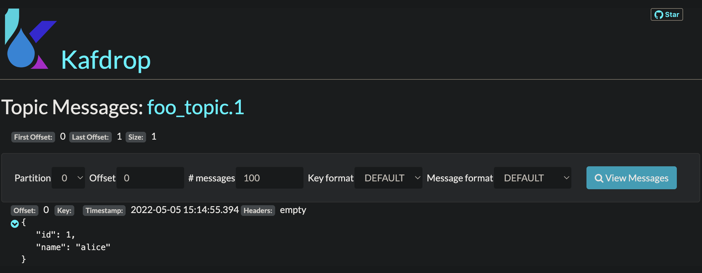

# Kafka

!!! Warning

    API сидирования для `kafka` будет изменён в следующих версиях!

В данном руководстве описана загрузка данных (сидирование) в `kafka`.

## Настройка окружения

Получите рабочую копию репозитория `seeder`:

```shell
git clone https://github.com/pkorobeinikov/seeder.git
```

Перейдите в каталог `seeder-showcase/kafka`:

```shell
cd seeder-showcase/kafka
```

Если вы используете решение отличное от `Docker Desktop`, экспортируйте
переменную окружения `DOCKER_HOST_IP` с адресом виртуальной машины, на которой
запущен `dockerd`.

Пропустите этот шаг, если `dockerd` доступен по адресу `localhost`.

```shell
export DOCKER_HOST_IP=$(minikube --profile minikube ip)
```

Разверните локальное окружение:

```shell
docker compose up [-d]
```

!!! note

    Если у вас не настроено расширение `compose`, самое время перейти на него
    или продолжить использовать устаревшую команду `docker-compose`.

## Изучение демонстрационных данных

Рассмотрите спецификацию описания сидов:

```shell
cat seeder.yaml
```

<!-- @formatter:off -->
```yaml title="seeder-showcase/kafka/seeder.yaml"
seeder:
  state:
    - name: kafka seed json file
      type: kafka # (1)
      config:
        - file: seed/seed.json # (2)

    - name: kafka seed yml file
      type: kafka
      config:
        - file: seed/seed.yml

```
<!-- @formatter:on -->

1. Тип хранилища
2. Файл с описанием сообщений

## Загрузка данных

Для загрузки данных выполните команду:

```shell
export SEEDER_KAFKA_PEER=localhost:9093

seeder
```

!!! note

    Если вы не используете `Docker Desktop`, вам, возможно, потребуется
    заменить `localhost` в строке подключения на правильное имя хоста
    или адрес машины с `dockerd`.

## Проверка результата

Наиболее простой способ проверить сидирование `kafka` — изучить содержимое
топиков в интерфейсе `kafdrop`.

Перейдите по адресу `http://localhost:9000` и изучите содержимое топиков:

<figure markdown>
  
  <figcaption>Содержимое топика</figcaption>
</figure>

## Резюме

В приведённом руководстве:

- Было развёрнуто локальное окружение с `kafka` для загрузки демонстрационных
  данных (сидов);
- Изучен формат описания сидов для `kafka`;
- Демонстрационные данные загружены в `kafka`.
